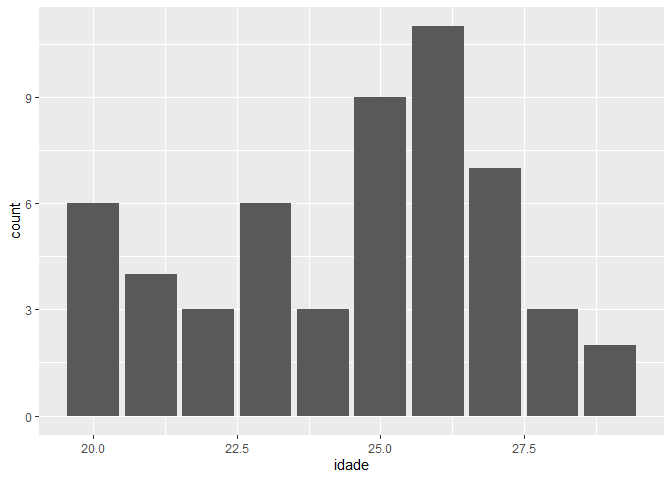
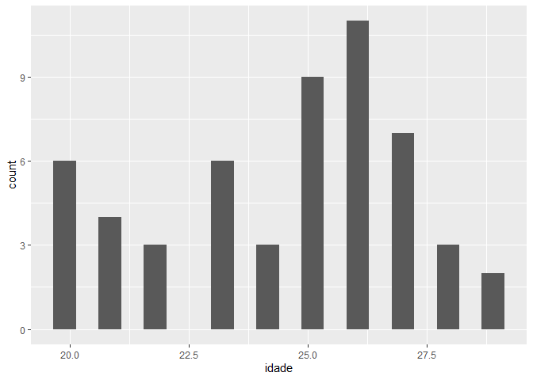
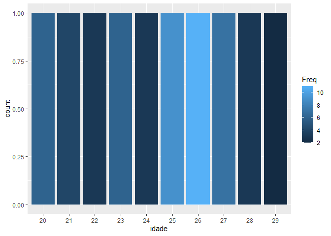
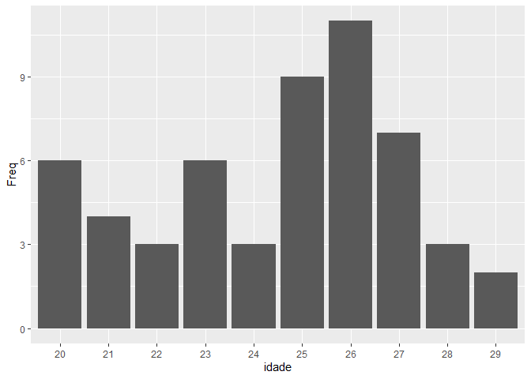
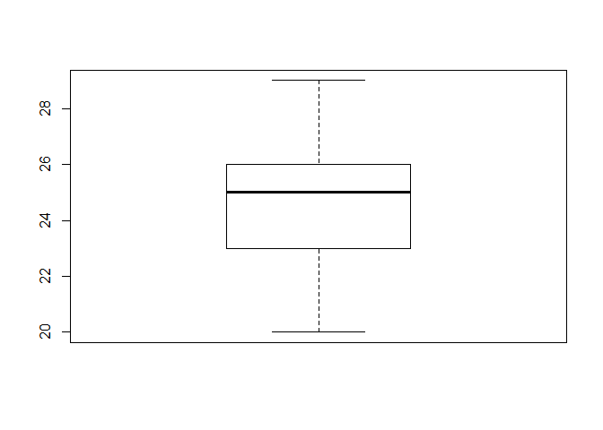

IDADES 1
================
Pedro Neto
26/10/2020

``` r
idade <- c(20, 22, 23, 23, 23, 24, 26, 27, 22,
24, 24, 26, 25, 25, 25, 21, 23, 21,
25, 25, 25, 25, 26, 26, 22, 20, 20,
26, 26, 20, 26, 26, 26, 21, 27, 27,
26, 26, 27, 27, 25, 25, 23, 20, 20,
27, 27, 28, 28, 29, 28, 23, 29, 21)
```

``` r
library(tidyverse)
```

``` r
df_idade2 <- data.frame(idade)
```

``` r
ggplot(data = df_idade2) +
  geom_bar(mapping = aes(x = idade))
```

<!-- -->

``` r
tabidade <- table(idade)
```

``` r
df_idade <- data.frame(tabidade, stringsAsFactors = FALSE)
```

``` r
ggplot(data = df_idade2) +
  geom_histogram(mapping = aes(x = idade), bins = 20)
```

<!-- -->

``` r
ggplot(data = df_idade2) +
  stat_count(mapping = aes(x = idade))
```

<!-- -->

``` r
ggplot(data = df_idade) +
  stat_count(mapping = aes(x = idade, fill = Freq), position = "fill")
```

<!-- -->

``` r
ggplot(data = df_idade) +
  geom_col(mapping = aes(x = idade , y = Freq))
```

<!-- -->

``` r
#20-23
#23-26
#26-29
```

# 

``` r
length(idade)
```

    ## [1] 54

``` r
#adicionando sexos
sexos_alunos<- sample(c("F", "M"), 54, replace = TRUE)
df_idade2$sexos_alunos <- sexos_alunos
```

# 

``` r
breaks <- seq(from = min(idade), to = max(idade), by = 3)
interv_idades <- cut(idade, breaks = c(20, 23, 26, 29), right = FALSE, include.lowest = TRUE)
table(interv_idades)
```

    ## interv_idades
    ## [20,23) [23,26) [26,29] 
    ##      13      18      23

``` r
#freq simples
df_freq_class <- data.frame(table(interv_idades), stringsAsFactors = FALSE)
```

``` r
#freq simples acumulada
freq_class_acumulada <- cumsum(table(interv_idades))
df_freq_class$freq_class_acumulada <- freq_class_acumulada
```

``` r
#freq relativa
freq_class_relativa <- round(prop.table(table(interv_idades))*100, digits = 2) 
df_freq_class$freq_class_relativa <- freq_class_relativa
```

``` r
#freq relativa acumulada
freq_class_acu_relativa <- cumsum(freq_class_relativa)
df_freq_class$freq_class_acu_relativa <- freq_class_acu_relativa
```

``` r
boxplot(idade)
```

<!-- -->

``` r
summary(idade)
```

    ##    Min. 1st Qu.  Median    Mean 3rd Qu.    Max. 
    ##   20.00   23.00   25.00   24.48   26.00   29.00

``` r
# MODA
# Create the function.
getmode <- function(v) {
  uniqv <- unique(v)
  uniqv[which.max(tabulate(match(v, uniqv)))]
}
```

``` r
# Create the vector with numbers.
v <- c(2,1,2,3,1,2,3,4,1,5,5,3,2,3)
```

``` r
# Calculate the mode using the user function.
result <- getmode(v)
print(result)
```

    ## [1] 2

``` r
# 
4 + (15.5-8)*0.2
```

    ## [1] 5.5
