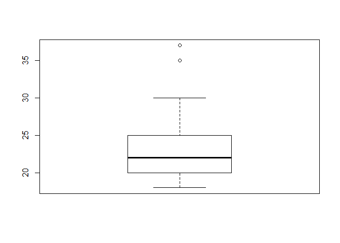
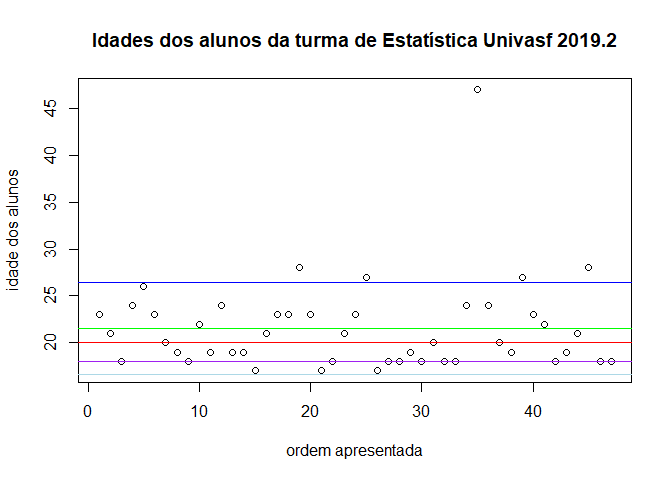
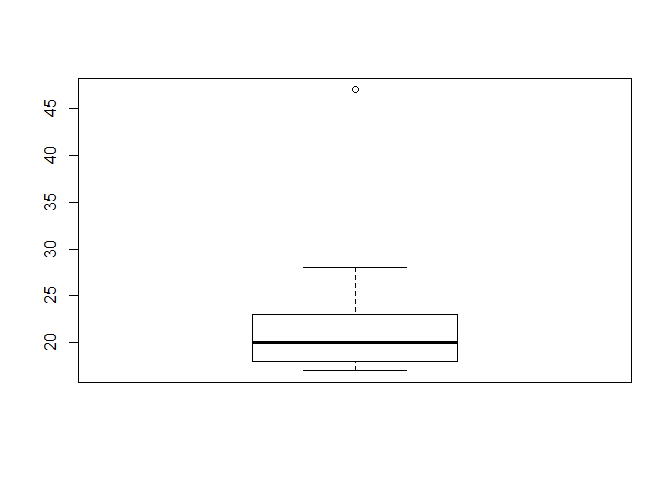
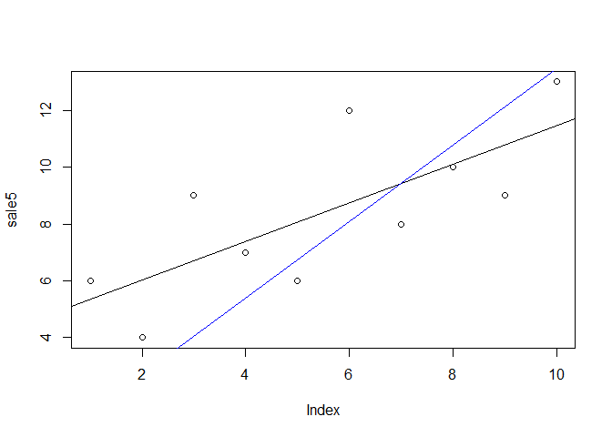

IDADES 2
================
Pedro Neto
26/10/2020

``` r
infalunos <- c(18, 18, 19, 20, 20, 20, 20, 20, 21, 21, 22, 23, 24, 25, 25, 25, 26, 29, 30, 35, 37)
```

``` r
boxplot(infalunos)
```

<!-- -->

``` r
df_infalunos <- data.frame(infalunos)
table(df_infalunos)
```

    ## df_infalunos
    ## 18 19 20 21 22 23 24 25 26 29 30 35 37 
    ##  2  1  5  2  1  1  1  3  1  1  1  1  1

``` r
boxplot(df_infalunos)
```

<!-- -->

``` r
id <- c(rep(18, 2), 19, rep(20, 6), rep(21, 2), 22, 23, 24, rep(25, 3), 26, 29, 30, 35, 37)
mean(id)
```

    ## [1] 23.54545

``` r
idades_alunos_adm <- c(23, 21, 18, 24, 26, 23, 20, 19,
                       18, 22, 19, 24, 19, 19, 17, 21,
                       23, 23, 28, 23, 17, 18, 21, 23,
                       27, 17, 18, 18, 19, 18, 20, 18,
                       18, 24, 47, 24, 20, 19, 27, 23,
                       22, 18, 19, 21, 28, 18, 18)
df_infalunos <- data.frame(idades_alunos_adm)
length(idades_alunos_adm)
```

    ## [1] 47

``` r
mean(idades_alunos_adm)
```

    ## [1] 21.48936

``` r
median(idades_alunos_adm)
```

    ## [1] 20

``` r
getmode <- function(idades_alunos_adm) {
  uniqv <- unique(idades_alunos_adm)
  uniqv[which.max(tabulate(match(idades_alunos_adm, uniqv)))]
}
moda <- getmode(idades_alunos_adm)
moda
```

    ## [1] 18

``` r
sd(idades_alunos_adm)
```

    ## [1] 4.898413

``` r
plot(idades_alunos_adm, main = "", xlab = "ordem apresentada", ylab = "idade dos alunos")
title(main = "Idades dos alunos da turma de Estatística Univasf 2019.2")
abline(h = mean(idades_alunos_adm), col = "green")
abline(h = mean(idades_alunos_adm) + sd(idades_alunos_adm), col = "blue")
abline(h = mean(idades_alunos_adm) - sd(idades_alunos_adm), col = "light blue")
abline(h = median(idades_alunos_adm), col = "red")
abline(h = moda, col = "purple")
```

<!-- -->

``` r
boxplot(idades_alunos_adm)
```

<!-- -->

``` r
require(stats)
sale5 <- c(6, 4, 9, 7, 6, 12, 8, 10, 9, 13)
plot(sale5)
abline(lsfit(1:10, sale5))
abline(lsfit(1:10, sale5, intercept = FALSE), col = 4)
```

<!-- -->

``` r
summary(idades_alunos_adm)
```

    ##    Min. 1st Qu.  Median    Mean 3rd Qu.    Max. 
    ##   17.00   18.00   20.00   21.49   23.00   47.00
