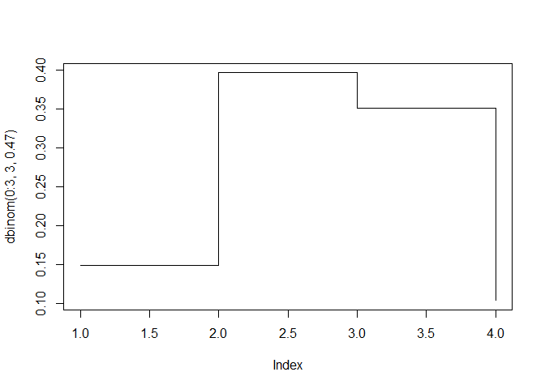
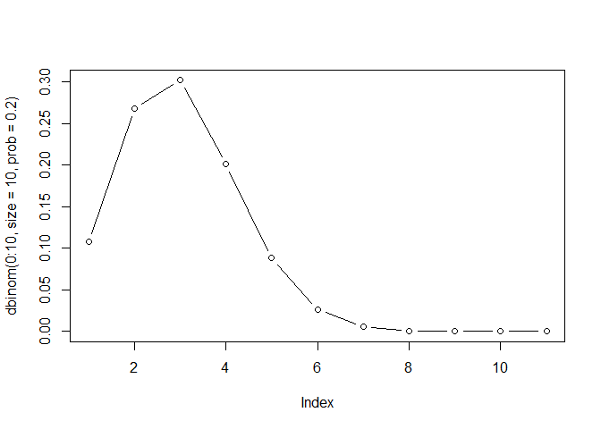
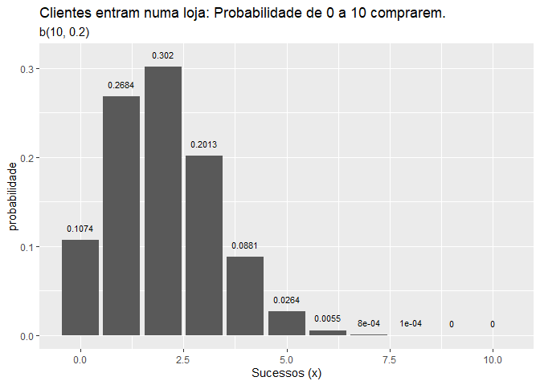
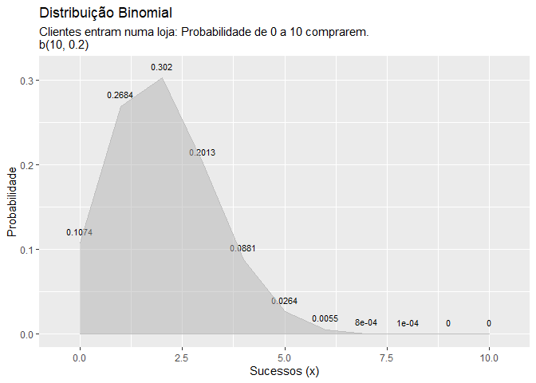
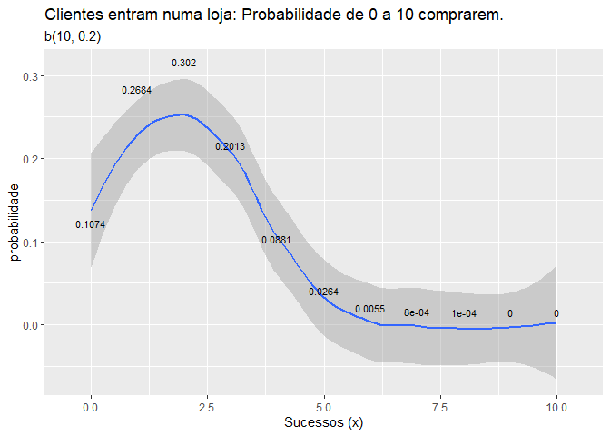

distribuição binomial
================
Pedro Neto
25/10/2020

DISTRIBUIÇÃO BINOMIAL

``` r
# n = 3, p = 0.47 prob de nascer homem
#        q = 0.53 prob de nascer nao homem

dbinom_filhos <- data.frame(dbinom(0:3, size = 3, prob = 0.47)) #P(x=0) todos os filhos n?o homem entre 3
#dbinom(1, 3, 0.47) #P(x=1) 1 filho homem entre 3
#dbinom(2, 3, 0.47) #P(x=2) 2 filhos homem entre 3
#dbinom(3, 3, 0.47) #P(x=3) 3 filhos homem entre 3
```

dbinom plot com r base

``` r
plot(dbinom(0:3, 3, 0.47), type = "s") #density
```

<!-- -->

``` r
dbinom(2, 3, 0.47)
```

    ## [1] 0.351231

``` r
qbinom(0:3, 3, 0.53) #quantile function
```

    ## Warning in qbinom(0:3, 3, 0.53): NaNs produzidos

    ## [1]   0   3 NaN NaN

``` r
rbinom(3, 1, 0.47) #random generation
```

    ## [1] 0 0 0

``` r
#pbinom() #distribution function


df_dbinom_filhos <- data.frame(n_de_filhos = 0:3, prob = dbinom(0:3, 3, 0.47))
```

USANDO GGPLOT2

``` r
library(tidyverse)
```

    ## -- Attaching packages --------------------------------------- tidyverse 1.3.0 --

    ## v ggplot2 3.3.2     v purrr   0.3.4
    ## v tibble  3.0.4     v dplyr   1.0.2
    ## v tidyr   1.1.2     v stringr 1.4.0
    ## v readr   1.4.0     v forcats 0.5.0

    ## -- Conflicts ------------------------------------------ tidyverse_conflicts() --
    ## x dplyr::filter() masks stats::filter()
    ## x dplyr::lag()    masks stats::lag()

``` r
ggplot(data = df_dbinom_filhos, mapping = aes(x = n_de_filhos, y = prob)) +
  geom_col() +
  geom_text(aes(label = round(prob,4), y = prob + 0.01),
    position = position_dodge(0.9),
    size = 3,
    vjust = 0) +
  labs(title = "Probabilidade de X = 0 a 3 filhos homens.",
       subtitle = "b(3, 0.47)",
       x = "Sucessos (x)",
       y = "probabilidade") 
```

<!-- -->

DISTRIBUICAO BINOMIAL n = 10 clientes que entram na loja, p = 0.2
probabilidade de vender, q = 0.8 prob de nao vender

``` r
dbinom_clientes<- data.frame(n_de_clientes = 0:10, prob = dbinom(0:10, size = 10, prob = 0.2))

plot(dbinom(0:10, size = 10, prob = 0.2), type = "b")
```

<!-- -->

``` r
plot(dbinom_clientes, type = "b")
```

<!-- -->

usando ggplot2

``` r
ggplot(data = dbinom_clientes, mapping = aes(x = n_de_clientes, y = prob)) +
  geom_col() +
  geom_text(aes(label = round(prob,4), y = prob + 0.01),
            position = position_dodge(0.9),
            size = 3,
            vjust = 0) +
  labs(title = "Clientes entram numa loja: Probabilidade de 0 a 10 comprarem.",
       subtitle = "b(10, 0.2)",
       x = "Sucessos (x)",
       y = "probabilidade") 
```

<!-- -->

usando linhas

``` r
ggplot(data = dbinom_clientes, mapping = aes(x = n_de_clientes, y = prob)) +
  geom_line() +
  geom_text(aes(label = round(prob,4), y = prob + 0.01),
            position = position_dodge(0.9),
            size = 3,
            vjust = 0) +
  labs(title = "Distribuição Binomial",
       subtitle = "Clientes entram numa loja: Probabilidade de 0 a 10 comprarem.
b(10, 0.2)",
       x = "Sucessos (x)",
       y = "Probabilidade") +
  geom_ribbon(mapping = aes(ymax = prob, ymin = 0), color = "grey", fill = "grey70", alpha = 0.5)
```

<!-- -->

smooth

``` r
ggplot(data = dbinom_clientes, mapping = aes(x = n_de_clientes, y = prob)) +
  geom_smooth() +
  geom_text(aes(label = round(prob,4), y = prob + 0.01),
            position = position_dodge(0.9),
            size = 3,
            vjust = 0) +
  labs(title = "Clientes entram numa loja: Probabilidade de 0 a 10 comprarem.",
       subtitle = "b(10, 0.2)",
       x = "Sucessos (x)",
       y = "probabilidade") 
```

    ## `geom_smooth()` using method = 'loess' and formula 'y ~ x'

<!-- -->

nada a ver

``` r
#rbind()
binomData = data.frame(Successes = rbinom(100, 3, .47))
ggplot(binomData, aes(x = Successes)) + geom_histogram(binwidth = 1)
```

<!-- -->
