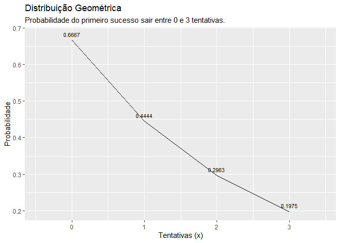
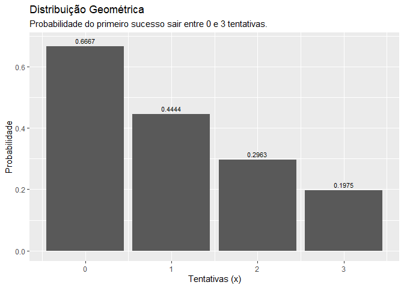

distr geométrica
================
Pedro Neto
2020-10-25

``` r
#formulas
#dgeom(x, prob, log = FALSE)
#pgeom(q, prob, lower.tail = TRUE, log.p = FALSE)
#qgeom(p, prob, lower.tail = TRUE, log.p = FALSE)
#rgeom(n, prob)

df_dist_geometrica <- data.frame(x = 0:3, prob = pgeom(q = 0:3, prob = 1/3, lower.tail = FALSE, log.p = FALSE))

library(tidyverse)
```

    ## -- Attaching packages --------------------------------------- tidyverse 1.3.0 --

    ## v ggplot2 3.3.2     v purrr   0.3.4
    ## v tibble  3.0.4     v dplyr   1.0.2
    ## v tidyr   1.1.2     v stringr 1.4.0
    ## v readr   1.4.0     v forcats 0.5.0

    ## -- Conflicts ------------------------------------------ tidyverse_conflicts() --
    ## x dplyr::filter() masks stats::filter()
    ## x dplyr::lag()    masks stats::lag()

``` r
##### USANDO LINHAS
ggplot(data = df_dist_geometrica, mapping = aes(x = x, y = prob)) +
  geom_line() +
  geom_text(aes(label = round(prob,4), y = prob + 0.01),
            position = position_dodge(0.9),
            size = 3,
            vjust = 0) +
  labs(title = "Distribuição Geométrica",
       subtitle = "Probabilidade do primeiro sucesso sair entre 0 e 3 tentativas.",
       x = "Tentativas (x)",
       y = "Probabilidade")
```

<!-- -->

``` r
##### USANDO COLUNAS
ggplot(data = df_dist_geometrica, mapping = aes(x = x, y = prob)) +
  geom_col() +
  geom_text(aes(label = round(prob,4), y = prob + 0.01),
            position = position_dodge(0.9),
            size = 3,
            vjust = 0) +
  labs(title = "Distribuição Geométrica",
       subtitle = "Probabilidade do primeiro sucesso sair entre 0 e 3 tentativas.",
       x = "Tentativas (x)",
       y = "Probabilidade")
```

<!-- -->
