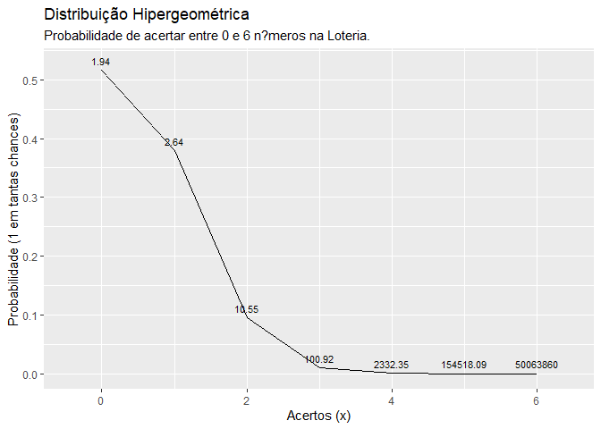
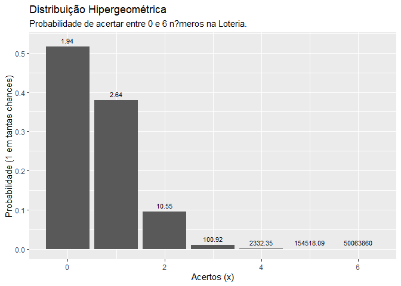

distribuição binomial
================
Pedro Neto
25/10/2020

Distribuição Hipergeométrica

``` r
dhyper(x = 2, m = 5, n = 7, k = 6, log = FALSE) #probabilidade de que 2 estejam queimadas
```

    ## [1] 0.3787879

``` r
#x = 2 lampadas queimadas entre as 6 retiradas
#m = 5 lampadas queimadas entre as 12 totais (historico)
#n = 7 lampadas n?o queimadas entre as 12 totais (historico)
#k = 6 lampadas retiradas entre as 12 totais


1- (dhyper(x = 1, m = 5, n = 7, k = 6, log = FALSE) +
  dhyper(x = 0, m = 5, n = 7, k = 6, log = FALSE)) #probabilidade de que pelo menos 2 estejam queimadas
```

    ## [1] 0.8787879

``` r
1-(0.007575758+ 0.113636364) +0.378787879
```

    ## [1] 1.257576

``` r
phyper(1, m = 5, n = 7, k = 6, lower.tail = FALSE, log.p = FALSE)
```

    ## [1] 0.8787879

``` r
# LOTERIA (MEGA-SENA) PROBABILIDADES ##############################

1/dhyper(x = 4, m = 6, n = 54, k = 6, log = FALSE) ############ QUADRA
```

    ## [1] 2332.348

``` r
dhyper(x = 5, m = 6, n = 54, k = 6, log = FALSE) ############ QUINA
```

    ## [1] 6.471734e-06

``` r
1/(dhyper(x = 6, m = 6, n = 54, k = 6, log = FALSE)) ############ SENA
```

    ## [1] 50063860

``` r
dhyper(x = 0, m = 6, n = 54, k = 6, log = FALSE) ############ NENHUM
```

    ## [1] 0.5158844

``` r
df_distri_hipergeometrica_megasena <- data.frame(acertos = 0:6, prob = dhyper(x = 0:6, m = 6, n = 54, k = 6, log = FALSE))

library("tidyverse")
```

    ## -- Attaching packages --------------------------------------- tidyverse 1.3.0 --

    ## v ggplot2 3.3.2     v purrr   0.3.4
    ## v tibble  3.0.4     v dplyr   1.0.2
    ## v tidyr   1.1.2     v stringr 1.4.0
    ## v readr   1.4.0     v forcats 0.5.0

    ## -- Conflicts ------------------------------------------ tidyverse_conflicts() --
    ## x dplyr::filter() masks stats::filter()
    ## x dplyr::lag()    masks stats::lag()

``` r
# USANDO LINHAS
ggplot(data = df_distri_hipergeometrica_megasena, mapping = aes(x = acertos, y = prob)) +
  geom_line() +
  geom_text(aes(label = round(1/prob,2), y = prob + 0.01),
            position = position_dodge(0.9),
            size = 3,
            vjust = 0) +
  labs(title = "Distribuição Hipergeométrica",
       subtitle = "Probabilidade de acertar entre 0 e 6 n?meros na Loteria.",
       x = "Acertos (x)",
       y = "Probabilidade (1 em tantas chances)")
```

<!-- -->

``` r
# USANDO COLUNAS
ggplot(data = df_distri_hipergeometrica_megasena, mapping = aes(x = acertos, y = prob)) +
  geom_col() +
  geom_text(aes(label = round(1/prob,2), y = prob + 0.01),
            position = position_dodge(0.9),
            size = 3,
            vjust = 0) +
  labs(title = "Distribuição Hipergeométrica",
       subtitle = "Probabilidade de acertar entre 0 e 6 n?meros na Loteria.",
       x = "Acertos (x)",
       y = "Probabilidade (1 em tantas chances)")
```

<!-- -->

``` r
#USANDO PONTOS

0
```

    ## [1] 0
