Distribuição Normal Padrão
================
Pedro Neto
26/10/2020

Distribuição Normal Padrão

``` r
df_quantisdades_distr_normal <- data.frame(x = 0:1 , prob = dnorm(x = c(-3, 3), mean = 0, sd = 1, log = FALSE)) 

# SEM GGPLOT2 (r base)
x=seq(-3,3,length=200)
y=dnorm(x,mean=0,sd=1)
plot(x,y,type="l",lwd=2,col="red")
```

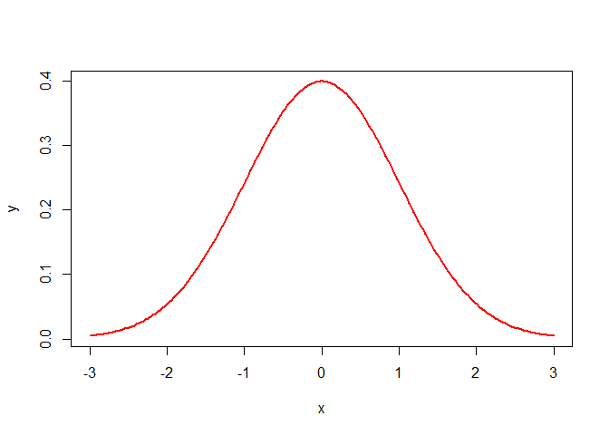<!-- -->

``` r
pnorm(0, mean = 0, sd = 1)
```

    ## [1] 0.5

``` r
#errado
#x = seq(0, 120)
#y = pnorm(96, mean=72, sd=5.3635, lower.tail=FALSE)
#plot(x, y, type = "l", lwd = 2, col = "red" ) 


###################################################################


# plot sem ser padrão

# Create a sequence of numbers between 0 and 120 incrementing by 1.
x <- seq(0, 120, by = 1)

# Choose the mean as 72 and standard deviation as 5.3665.
y <- dnorm(x, mean = 72, sd = 5.3665)

plot(x,y, type = "l")
```

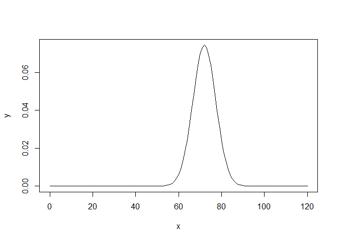<!-- -->

``` r
# plot padrão
x <- seq(-3, 3, length = 200)
y <- dnorm(x, mean = 0, sd = 1)
plot(x,y, type = "l")
```

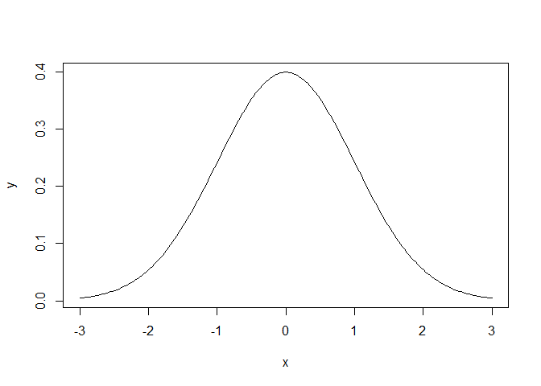<!-- -->

``` r
x <- seq(55, 90, length = 200)
y <- dnorm(x, mean = 72, sd = 5.3665)
plot(x,y, type = "l")
```

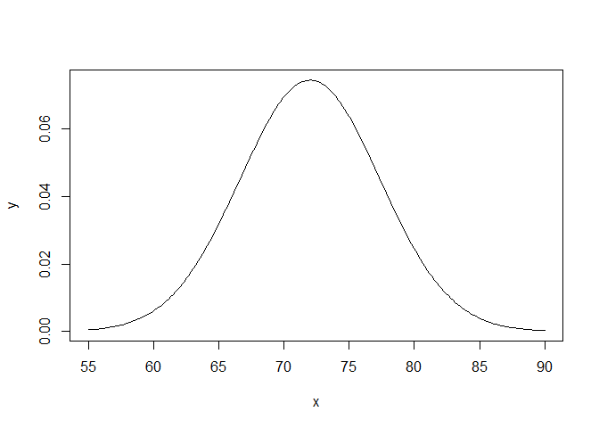<!-- -->

``` r
x <- seq(20000, 50000, length = 200)
y <- dnorm(x, mean = 35000, sd = 5000)
plot(x,y, type = "l")
```

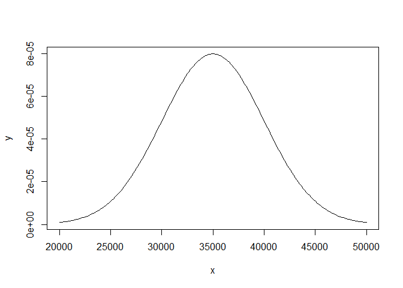<!-- -->

``` r
x <- seq(-3, 3, length = 200)
y <- dnorm(x, mean = 0, sd = 1)
plot(x,y, type = "l")

x <- seq(-3,0,length = 100)
y <- dnorm(x, mean = 0, sd = 1)
polygon(c(-3,x,0), c(0,y,0), col = "darkred")
```

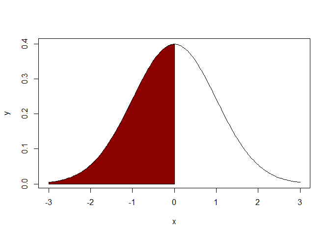<!-- -->

``` r
#verificando a area a esquerda (deve ser 0.5)
pnorm(0, mean = 0, sd = 1)
```

    ## [1] 0.5

``` r
x=seq(-3,3,length=200)
y=dnorm(x,mean=0,sd=1)
plot(x,y,type="l")
x=seq(0.4,1.8,length=100)
y=dnorm(x,mean=0,sd=1)
polygon(c(0.4,x,1.8),c(0,y,0),col="red")

pnorm(0.4, mean = 0, sd = 1, lower.tail = TRUE) 
```

    ## [1] 0.6554217

``` r
#prob menor igual a 0.4 = 65.54%

pnorm(0.4, mean = 0, sd = 1, lower.tail = TRUE) - pnorm(0, mean = 0, sd = 1, lower.tail = TRUE)
```

    ## [1] 0.1554217

``` r
#prob entre 0 e 0.4 = 15.54%

pnorm(0.4, mean = 0, sd = 1, lower.tail = FALSE) #maior que 0.4
```

    ## [1] 0.3445783

``` r
################################################

df_dnormpadrao_teste1 <- data.frame(x = x, prob = y)

##############################
library("tidyverse")
```

    ## -- Attaching packages --------------------------------------- tidyverse 1.3.0 --

    ## v ggplot2 3.3.2     v purrr   0.3.4
    ## v tibble  3.0.4     v dplyr   1.0.2
    ## v tidyr   1.1.2     v stringr 1.4.0
    ## v readr   1.4.0     v forcats 0.5.0

    ## -- Conflicts ------------------------------------------ tidyverse_conflicts() --
    ## x dplyr::filter() masks stats::filter()
    ## x dplyr::lag()    masks stats::lag()

<!-- -->

``` r
ggplot(df_dnormpadrao_teste1, aes(x = x, y = prob)) +
  stat_function(fun = dnorm, n = 200, args = c(mean = 0, sd = 1), col = "tomato")
```

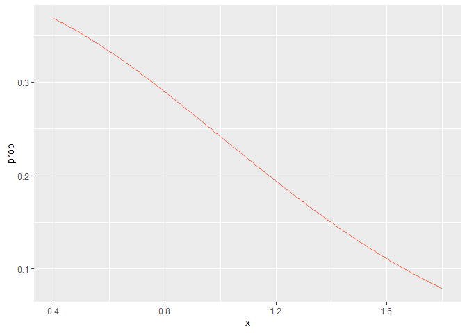<!-- -->

``` r
# EXEMPLO 1 (z = 1.75, mean = 0, sd = 1)
pnorm(q = 1.75, lower.tail = TRUE) #prob de ser menor igual a 1.75 = 95.99%
```

    ## [1] 0.9599408

``` r
pnorm(q = 1.75, lower.tail = FALSE) #prob de ser maior que 1.75 = 4%
```

    ## [1] 0.04005916

``` r
pnorm(q = 1.75, lower.tail = TRUE) - pnorm(q = 0, lower.tail = TRUE) #prob de ser menor que 1.75 e maior que 0 P(0<z<=1.75)
```

    ## [1] 0.4599408

``` r
# EXEMPLO 2 (-1.89<z<2.00)
pnorm(q = 2, lower.tail = TRUE) - pnorm(q = -1.89, lower.tail = TRUE) # P(-1.89<z<2)= 94.78%
```

    ## [1] 0.9478709

``` r
## lower.tail = TRUE X<=x, lower.tail = FALSE X>x
# EXEMPLO 3 (RECEITA DAS MICROEMPRESAS NO ESTADO DE PERNAMBUCO, mean = 36000, sd = 5000, 
###ou mean = 0, sd = 1, z = 0.4 e z = 1.8)
#################### P(0.4 < z < 1.8) = P(38000 < x < 45000) = 30.87%
pnorm(q = 1.8, lower.tail = TRUE) #probabilidade de ser menor igual a 1.8 = 96.40%
```

    ## [1] 0.9640697

``` r
pnorm(q = 1.8, lower.tail = FALSE) #probabilidade de ser maior que 1.8 = 3.59%
```

    ## [1] 0.03593032

``` r
pnorm(q = 0.4, lower.tail = TRUE) #probabilidade de ser menor igual a 0.4 = 65.54%
```

    ## [1] 0.6554217

``` r
pnorm(q = 0.4, lower.tail = FALSE) #probabilidade de ser maior que 0.4 = 34.45%
```

    ## [1] 0.3445783

``` r
# EXEMPLO 4
pnorm(q = 4.47, lower.tail = FALSE) # prob de ser maior que 4.47 = 0.00039% (evento raro)
```

    ## [1] 3.91098e-06

``` r
pnorm(q = 4.47, lower.tail = TRUE) - pnorm(q=0, lower.tail = TRUE) # prob entre 0 e 4.47 = 49.99%
```

    ## [1] 0.4999961

``` r
# ou fazendo sem padr?o (sem mean = 0 e sem sd = 1)
pnorm(q = 96, mean = 72, sd = 5.3665, lower.tail = FALSE) # prob de ser maior que 96 = 0.00039% (evento raro)
```

    ## [1] 3.871155e-06

``` r
# EXEMPLO 5
pnorm(66, 72, 5.3665, lower.tail = TRUE) # prob menor igual a 66 = 13.17%
```

    ## [1] 0.1317734

``` r
pnorm(-1.1194, lower.tail = TRUE) # prob menor igual a -1.12 = 13.15%
```

    ## [1] 0.1314848

``` r
# EXEMPLO 6a
pnorm(q = 14.7, mean = 11.15, sd = 2.238, lower.tail = TRUE) - pnorm(q = 8.7, mean = 11.15, sd = 2.238, lower.tail = TRUE) 
```

    ## [1] 0.8068393

``` r
#prob da espessura estar entre 8.7mm e 14.7mm, sendo a m?dia 11.15 e o sd = 2.238mm ? de 80.68%

pnorm(q = 1.5862, lower.tail = TRUE) - pnorm(q = -1.0947, lower.tail = TRUE)
```

    ## [1] 0.806829

``` r
#prob da espessura estar entre -1.09 e 1.58, sendo a m?dia 0 e o sd = 1 ? de 80.68%

# EXEMPLO 6b
pnorm(q = 11.17, mean = 11.15, sd = 2.238, lower.tail = TRUE) - pnorm(q = 11.12, mean = 11.15, sd = 2.238, lower.tail = TRUE)
```

    ## [1] 0.008912712

``` r
#prob da espessura estar entre 11.12mm e 11.17mm, sendo a m?dia 11.15 e o sd = 2.238mm ? de 8.91%

pnorm(q = 0.008936, lower.tail = TRUE) - pnorm(q = -0.0134, lower.tail = TRUE)
```

    ## [1] 0.008910567

``` r
#prob da espessura estar entre -0.0134 e 0.008936, sendo a m?dia 0 e o sd = 1 ? de 8.91%


x <- seq(-3, 3, by = 0.1)
y <- dnorm(x, mean = 0, sd = 1)
plot(x,y, type = "l")
x=seq(0.4,1.8,length=100)
y=dnorm(x,mean=0,sd=1)
polygon(c(0.4,x,1.8),c(0,y,0),col="red")
text(1, 0.1, "30,87%")
arrows(-0.4,0.1,0.45,0,length=.15)
text(-0.4,0.12,"0.4")
```

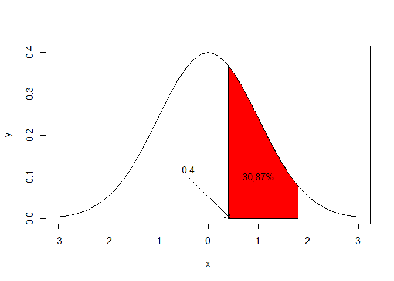<!-- -->

``` r
# com ggplot

ggplot(data = data.frame(x = c(-3, 3)), aes(x)) +
  stat_function(fun = dnorm, n = 200, args = list(mean = 0, sd = 1)) + ylab("") +
  scale_y_continuous(breaks = NULL)
```

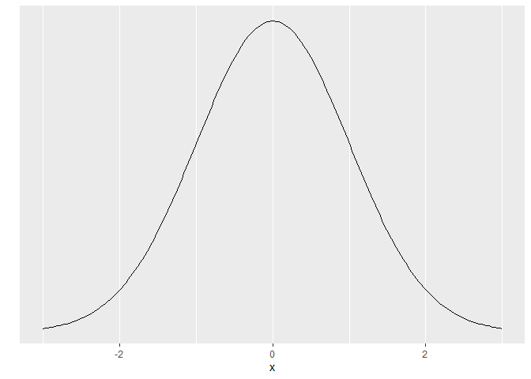<!-- -->

``` r
x <- seq(-3, 3, by = 0.1)
y <- dnorm(x, mean = 0, sd = 1)
df_ditr_normal_preenchida <- data.frame(x = x, y = y)
ggplot(df_ditr_normal_preenchida, aes(x = x, y = y)) +
  stat_function(fun = dnorm, n = 200, args = c(mean = 0, sd = 1), col = "tomato") +
  geom_ribbon(data=subset(df_ditr_normal_preenchida ,x>=-1.09 & x<=1.58),aes(ymax=y),ymin=0, fill="red",colour=NA,alpha=0.5)+
  scale_y_continuous(limits=c(0, .4)) +
  geom_ribbon(data=subset(df_ditr_normal_preenchida ,x>=-3 & x<=(-1.09)),aes(ymax=y),ymin=0, fill="blue",colour=NA,alpha=0.5) +
  geom_ribbon(data=subset(df_ditr_normal_preenchida ,x>=1.58 & x<=3),aes(ymax=y),ymin=0, fill="green",colour=NA,alpha=0.5)
```

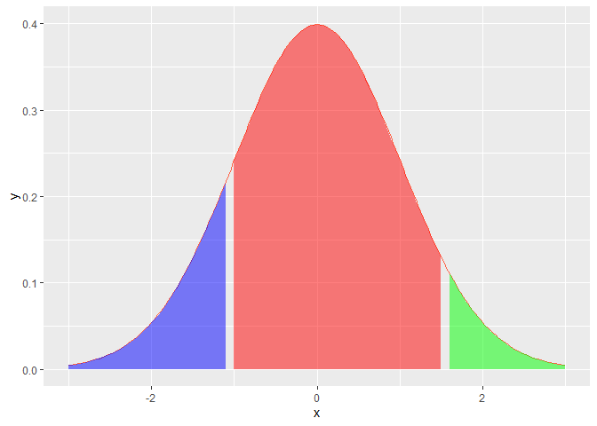<!-- -->

``` r
ggplot(data.frame(x = c(-3, 3)), aes(x)) +
  stat_function(fun = dnorm) + 
  stat_function(fun = dnorm, 
                xlim = c(-1.09,1.58),
                geom = "area", fill = "blue", alpha = 0.5) +
  annotate("text", x = 0, y = 0.2, label = round(((pnorm(q = 1.5862, lower.tail = TRUE) - pnorm(q = -1.0947, lower.tail = TRUE))*100), 2)) +
  stat_function(fun = dnorm, 
                xlim = c(1.58,3),
                geom = "area", fill = "red", alpha = 0.5) +
  annotate("text", x = 2, y = 0.05, label = round(((pnorm(q = 1.5862, lower.tail = FALSE))*100), 2)) +
  stat_function(fun = dnorm, 
                xlim = c(-3,-1.09),
                geom = "area", fill = "green", alpha = 0.5) +
  annotate("text", x = -1.5, y = 0.05, label = round(((pnorm(q = -1.09, lower.tail = TRUE))*100), 2))
```

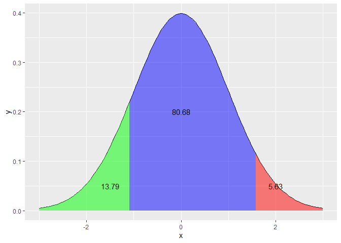<!-- -->

lombrando

``` r
ggplot(mtcars, aes(x = wt, y = mpg)) + 
  geom_point() +
  annotate("text", x = 4, y = 25, label = "Some text")
```

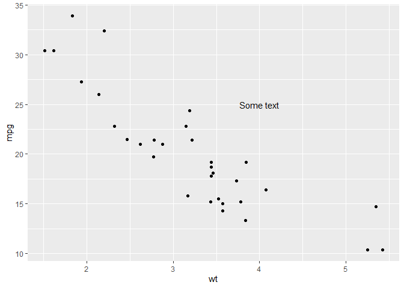<!-- -->
